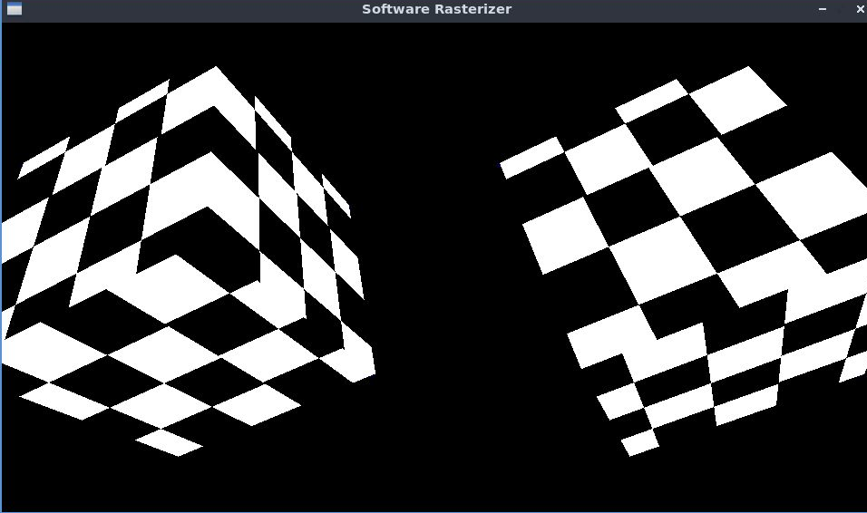

# rasterizer
Software Rasterizer

Aims to be correct (subpixel accuracy, proper fill rules, z-buffer etc.) and fast (SIMD). Work-in-progress.

Loads .obj meshes and .bmp images.

The only dependency is SDL2.

Author: [Timo Wirén](http://twiren.kapsi.fi)

